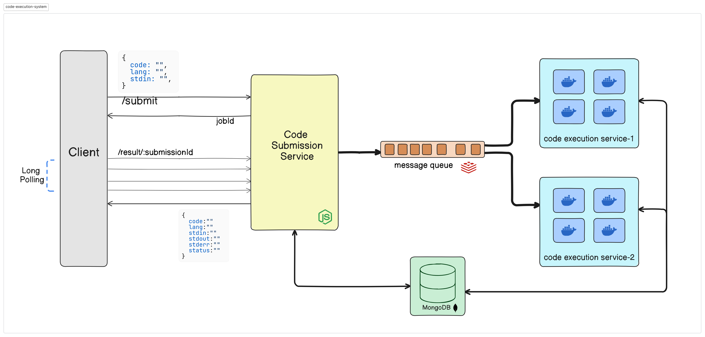

# Remote Code Execution System

This is a Remote Code Execution System, which runs your code in **secure**, **isolated** and **lightweight** Docker Container.

It is highly scalable and uses microservices architecture. And built with **Node.js**, **BullMQ**, **Docker**, **Redis**, **MongoDB**, **Express.js**, etc.

## Table of Contents
1. [Architecture Design](#architecture-design)
   - [Code Submission Service](#code-submission-service)
   - [Code Execution Service](#code-execution-service)
   - [How it works](#how-it-works)
   - [Message Queue](#message-queue)
2. [Scalability](#scalability)
3. [Security](#security)
4. [What I learned from this project](#what-i-learned-from-this-project)
5. [Future Improvements](#future-improvements)
6. [API Docs](#api-docs)
7. [How to run it locally](#how-to-run-it-locally)


## Architecture Design

### It has 2 microservices 
1. **Code Submission Service**

2. **Code Execution Service**
---



### Code Submission Service

It is a simple service that accepts the code, code-language and input from the user, then save it to the database and add the job to the message queue (BullMQ) and return the jobId immediately.

#### Long polling
After getting the jobId, the client will make subseqent requests after every specified interval to check the status of the job.
If status of job is pending, it means the job is waiting in queue or under execution.
If status is completed, then it returns the output of the code.


### Code Execution Service

It is the **main** service that executes the code.
It takes the Job from the message queue and execute it securely in a isolated **docker** container. 

It can scale horizontally, by adding more instances of this service.

Each instance can run as many worker/containers according to the hardware of the machine.

In the above diagram, we have 2 instances of Code Execution Service, and each instance can run upto 4 containers.

### How it works

We are using a NPM package called [dockerode](https://github.com/apocas/dockerode) to communicate with docker daemon of the host machine, which can create , start , stop and remove the docker containers, we can run commands inside container and stream the logs.

we can spin up as many containers as we want, and can run as many jobs as we want, it is scalable and fast. but there is a catch, will come to that later.

Whenever a job arrives in the message queue, it spin up a new docker container according to the language of the code, and execute the command in that container with code and input. and listen for the logs.

Once the code executed successfully, it stop and removes the container and process the logs.

Here, processing the logs is essential, as docker provides a stream of logs , which have a specific format, each chunk/message of stream contains a header and content, header specifies the content size and log type, like stdout, stderr.

So, After processing the logs, output (can be stdout or stderr or both) is saved in the database.

Now with the help of long polling, client will get the output of the code.

### Message Queue

As we can't execute the code in the same service, where the code is submitted, because it will overload the service, and not a scalable solution. So for that asynchronous processing is good approach.

For that, we are using [BullMQ](https://github.com/OptimalBits/bullmq), it is simple, powerful and highly scalable queuing system for producing and consuming events or messages.

Code Submission Service will produce the job to the message queue, and each instance of Code Execution Service will consume the job from the message queue. Note, that a job will be only consumed by one of the instance of Code Execution Service.


## Scalability

As we mentioned above, we can scale it horizontally by adding more instances of Code Execution Service.

As we are using BullMQ, it will distribute the jobs evenly across the instances of Code Execution Service.


## Security

**Isolation**

User code is executed in a isolated docker container, so it can't affect the host machine. as well as it can't affect other running containers

**Resource Limits**

Strict resource limits are enforced to prevent resource exhaustion attacks and ensure fair resource allocation.
We can set limits on 
   - CPU usage
   - Memory consumption
   - execution time
   - Network access
   - Disk I/O
   - processes count


## What I learned from this project

 - How Asynchronous processing works, and how to implement a scalable **Message Queue** system with BullMQ.

 - How remote code execution works, and how to implement a scalable **Code Execution service** with help of Docker Containers.

 - **Node.js Streams** , Streams are a powerful way to handle data, and how to read from a stream in chunks and then process it.

 - How to handle **Concurrency** in worker, and if the tasks are non-blocking, then how to run multiple tasks in parallel.


## Future Improvements

 - Adding a **Caching** system to cache the code execution results, to reduce the latency.

 - Adding a **Rate Limiting** system to limit the number of requests per user.

 - Adding tests for the code.


## API Docs


> POST: /api/submit
```
Request Body:
{
    "code": "print('Hello, World!')",
    "lang": "python",
    "stdInput": ""            //optional
}
```

```
Response status: 201
Response body:
{
    "message": "Code submission queued successfully",
    "codeSubmissionId": "1234567890"
}
```
---

> GET: /api/result/:submissionId

```
Job Pending Response:
{
    "message": "Code execution is still pending",
}
```
```
Job Completed Response:
{
    "code": "print('Hello, World!')",
    "lang": "python",
    "stdInput": "",
    "stdOutput": "Hello, World!",
    "stdError": "",
    "status": "completed", 
}
```

---

## How to run it locally

To run this project you need a docker engine running on your machine.

1. Clone this repository

```bash
git clone https://github.com/ashishDevv/Code-Execution-Engine.git
```
2. Create two `.env` files, one in `code-execution-service`  and other in `code-submission-service` directory and add key and values by taking reference from `.example.env` file


3. Choose Your OS
 - For Windows users

    
   - You need to enable a setting in your docker desktop.

      > Go to settings -> General -> Enable the option "Expose daemon on tcp://localhost:2375 without TLS" 
 
   


- For Linux Users
   
   - Go to Project and Open the `compose.yaml` file and Do these changes
     - change `HOST_OS` value to `linux` and remove `DOCKER_HOST` from environment section
     ```yaml
     environment:
      - HOST_OS=linux     # only this needed
     ``` 

     - Add new volume in `volumes` section
     ```yaml
     volumes:
      - /var/run/docker.sock:/var/run/docker.sock
     ```


4. Now go to the directory of the project and open a terminal and run the following command to start the services.
```bash
docker compose -d up --build
```

5. Now you can access the api at `http://localhost:3005/api/submit` using postman or any other api client. **Note :** Make sure no other process is using port `3005`


